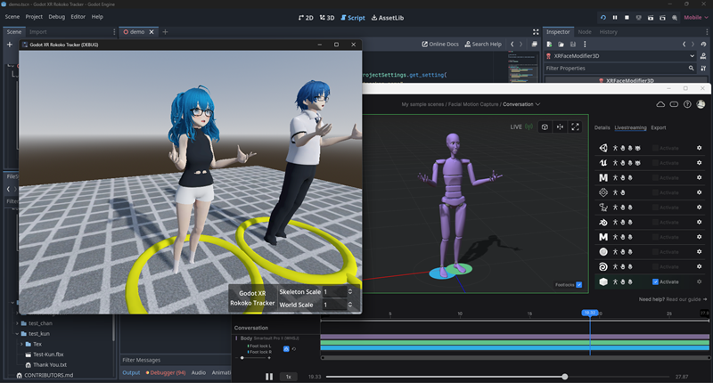

# Godot XR Rokoko Tracker

This repository contains a Rokoko packet decoder for Godot that can drive avatars through the XR Tracker system.

## Versions

Official releases are tagged and can be found [here](https://github.com/Malcolmnixon/GodotXRRokokoTracker/releases).

The following branches are in active development:
|  Branch   |  Description                  |  Godot version   |
|-----------|-------------------------------|------------------|
|  master   | Current development branch    |  Godot 4.3-rc2+ |

## Overview

[Rokoko Studio](https://www.rokoko.com/products/studio) is a Motion Capture package by Rokoko.

## Usage

The following steps show how to add the Godot Rokoko tracker to a project.

### Enable Addon

The addon files needs to be copied to the `/addons/godot_rokoko_tracker` folder of the Godot project, and then enabled in Plugins under the Project Settings:

### Plugin Settings

The plugin has numerous options to control behavior:

| Option | Description |
| :----- | :---------- |
| Tracking - Position Mode | Controls the position of the character: - Free = Free Movement - Calibrate = Calibrate to origin on first frame - Locked = Lock to origin |
| Tracking - Face Tracker Name | Name for the [XRFaceTracker](https://docs.godotengine.org/en/latest/classes/class_xrfacetracker.html) |
| Tracking - Body Tracker Name | Name for the [XRBodyTracker](https://docs.godotengine.org/en/latest/classes/class_xrbodytracker.html) |
| Network - Udp Listener Port | Port to listen for Rokoko network packets |

### Character Importing

The character model must be in Godot Humanoid format. This can be achieved in the importer settings by retarteting the skeleton to the SkeletonProfileHumanoid bone map:

### Body Driving

The body is positioned using an [XRNode3D](https://docs.godotengine.org/en/latest/classes/class_xrnode3d.html) node configured to track the character body:

The body is posed using an [XRBodyModifier3D](https://docs.godotengine.org/en/latest/classes/class_xrbodymodifier3d.html) node skeleton modifier:

Note that the Body Tracker name should match the Body Tracker Name specified in the Plugin Settings.

### Face Driving

The face is driven using an [XRFaceModifier3D](https://docs.godotengine.org/en/latest/classes/class_xrfacemodifier3d.html) node configured to drive the facial blendshapes of the character:

Note that the Face Tracker name should match the Face Tracker Name specified in the Plugin Settings.

### Rokoko Studio

Rokoko Studio must be configured for network streaming, which is an option only in the Plus, Pro, and Enterprise subscriptions.

| Option | Description |
| :----- | :---------- |
| Protocol | Custom Streaming | 
| Forward IP | Host address (127.0.0.1 for localhost) | 
| Port | UDP Port 14043 (default) |
| Data Format | Json (Rokoko JSON v3.0) |

## Licensing

Code in this repository is licensed under the MIT license.

## About this repository

This repository was created by Malcolm Nixon

It is primarily maintained by:
- [Malcolm Nixon](https://github.com/Malcolmnixon/)

For further contributors please see `CONTRIBUTORS.md`
